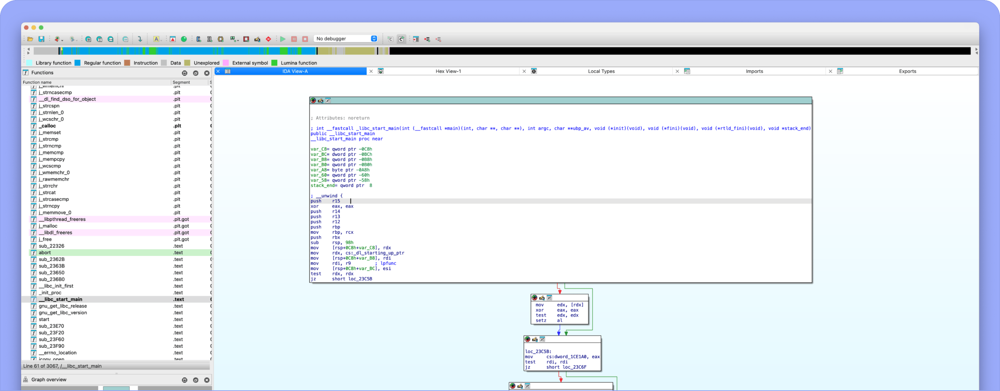

# IDA Pro 9.0 Keygen

[](https://github.com/decryptable/IDA-Pro_9.0_Keygen/releases)

This project is a license generator and patcher for **IDA Pro 9.0**, designed to create valid license files and patch IDA Pro library files for extended functionality. It provides a user-friendly graphical interface built with CustomTkinter and supports Windows, macOS, and Linux.

## Table of Contents

- [Features](#features)
- [Prerequisites](#prerequisites)
- [Installation](#installation)
- [Usage](#usage)
- [Building from Source](#building-from-source)
- [Project Structure](#project-structure)
- [Contributing](#contributing)
- [License](#license)
- [Contact](#contact)

## Features

- **License Generation**: Creates a valid `idapro.hexlic` license file for IDA Pro 9.0 with customizable name, email, and add-ons.
- **Library Patching**: Patches IDA Pro library files (`.dll`, `.so`, `.dylib`) to modify the public modulus for compatibility with generated licenses.
- **Cross-Platform Support**: Runs on Windows, macOS, and Linux with platform-specific icon support.
- **Graphical User Interface**: Built with CustomTkinter, offering an intuitive interface for folder selection, license generation, and patching.
- **Administrator Check**: Ensures the program runs with appropriate permissions on Windows.
- **Version Validation**: Verifies the IDA Pro installation is version 9.0 before proceeding.
- **Automated Builds**: GitHub Actions workflow for building executables across platforms using Nuitka.
- **Extensive Add-On Support**: Includes all major IDA Pro add-ons (e.g., HEXX86, HEXX64, HEXARM, etc.) in generated licenses.

## Prerequisites

- **Python 3.10 or higher** (for running from source).
- **IDA Pro 9.0** installed in a valid directory.
- Administrator privileges (required on Windows for patching).
- Required Python packages (listed in `requirements.txt`):
  - `nuitka`
  - `customtkinter`
  - `imageio`
  - `pywin32` (Windows only, for version checking).

## Installation

### Option 1: Download Prebuilt Executables

1. Visit the [Releases](https://github.com/decryptable/IDA-Pro_9.0_Keygen/releases) page.
2. Download the executable for your operating system (Windows, macOS, or Linux).
3. Run the executable (ensure administrator privileges on Windows).

### Option 2: Run from Source

1. Clone the repository:

   ```bash
   git clone https://github.com/decryptable/IDA-Pro_9.0_Keygen.git
   cd IDA-Pro_9.0_Keygen
   ```

2. Install dependencies:

   ```bash
   pip install -r requirements.txt
   ```

3. (Windows only) Install `pywin32`:

   ```bash
   pip install pywin32
   ```

4. Run the script:

   ```bash
   python IDA_Keygen.py
   ```

## Usage

1. **Launch the Application**:
   - Run the prebuilt executable or execute `python IDA_Keygen.py` from the source.
   - On Windows, ensure you run as administrator.

2. **Select IDA Pro Folder**:
   - Click "Browse" to select the IDA Pro 9.0 installation folder (containing `ida.exe`, `ida`, or library files like `ida32.dll`).
   - The application validates the folder for IDA Pro 9.0 and required library files.

3. **Enter Licensee Details**:
   - Input a name (default: `decryptable`) and email (default: `hack@decryptable.dev`).

4. **Generate License**:
   - Click "Generate License" to create an `idapro.hexlic` file in the IDA Pro folder.
   - The license includes all add-ons (e.g., HEXX86, HEXARM) and is valid until 2033.

5. **Patch Library Files**:
   - Click "Patch IDA Pro" to patch library files (e.g., `ida32.dll`, `libida64.so`) in the selected folder.
   - Patched files are saved with a `.patched` suffix.

6. **View Status**:
   - The status textbox displays detailed output, including license details and patching results.

7. **About**:
   - Click "About" for author information and version compatibility details.

### Notes

- The tool checks for IDA Pro 9.0 specifically. Other versions may not work.
- Patching overwrites the public modulus in library files. Back up original files before patching.
- Generated licenses are tied to the provided name and email.

## Building from Source

To build a standalone executable, use the provided GitHub Actions workflow or run Nuitka manually.

### Manual Build with Nuitka

1. Install Nuitka:

   ```bash
   pip install nuitka
   ```

2. Build the executable:

   ```bash
   python -m nuitka --onefile --enable-plugin=tk-inter --include-data-file=icon.ico=./icon.ico --include-data-file=icon.png=./icon.png --product-name="IDA Keygen" --file-description="Keygen for IDA Pro" --copyright="decryptable" --company-name="decryptable" IDA_Keygen.py
   ```

3. The output executable will be in the `build` directory.

### GitHub Actions Workflow

The `release.yaml` automates building executables for Windows, macOS, and Linux on tagged releases (e.g., `v1.0.0.0`). To trigger a build:

1. Create a new tag:

   ```bash
   git tag v1.0.0.0
   git push origin v1.0.0.0
   ```

2. The workflow builds executables and uploads them as release assets.

## Project Structure

```bash
IDA-Pro_9.0_Keygen/
├── .gitignore               # Ignored files for Git
├── requirements.txt         # Python dependencies
├── IDA_Keygen.py            # Main application script
├── release.yaml             # GitHub Actions workflow for building
├── icon.ico                 # Windows icon (not in repo, assumed present)
├── icon.png                 # macOS/Linux icon (not in repo, assumed present)
```

### Key Files

- **IDA_Keygen.py**: Core script implementing the GUI, license generation, and patching logic.
- **requirements.txt**: Lists dependencies for running and building the application.
- **release.yaml**: Configures automated builds for releases.
- **.gitignore**: Excludes build artifacts, virtual environments, and other temporary files.

## Contributing

Contributions are welcome! To contribute:

1. Fork the repository.
2. Create a feature branch (`git checkout -b feature/your-feature`).
3. Commit changes (`git commit -m "Add your feature"`).
4. Push to the branch (`git push origin feature/your-feature`).
5. Open a pull request.

Please ensure your code follows PEP 8 and includes appropriate tests.

## License

This project is licensed under the MIT License. See the [LICENSE](LICENSE) file for details.

## Contact

- **Author**: decryptable
- **Contact**: [Telegram](https://t.me/hexac)
- **Repository**: [https://github.com/decryptable/IDA-Pro_9.0_Keygen](https://github.com/decryptable/IDA-Pro_9.0_Keygen)

For issues or feature requests, please open an issue on GitHub.
